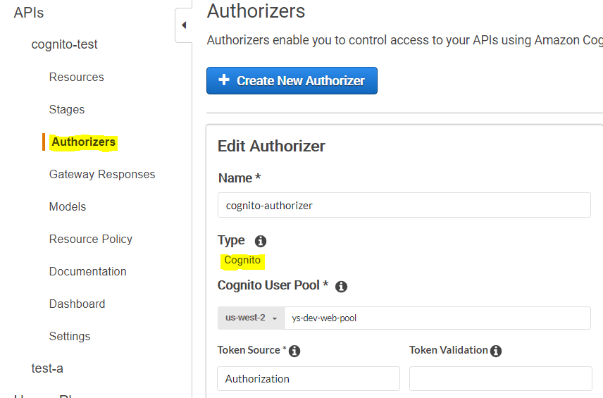

## AWS CLIでCognitoユーザーのパスワード変更
```$xslt
aws cognito-idp admin-initiate-auth \
--user-pool-id us-west-2_xxxx \
--client-id xxxx \
--auth-flow ADMIN_NO_SRP_AUTH \
--auth-parameters \
USERNAME=xxxx,PASSWORD=xxxx
  -> sessionが取得できる 

aws cognito-idp admin-respond-to-auth-challenge \
--user-pool-id us-west-2_xxxx \
--client-id xxxx \
--challenge-name NEW_PASSWORD_REQUIRED \
--challenge-responses NEW_PASSWORD='xxxx',USERNAME=xxxx \
--session "xxx"
```

## IdTokenをDecodeしてみる
* ツール
    * https://jwt.io/
* 中身
```
    {
      "sub": "3ad0a201-912d-4ab2-8a93-597a896d3eea",
      "aud": "{App Client Id}",
      "email_verified": true,
      "event_id": "81775974-6b0d-11e9-803b-1946dd43098e",
      "token_use": "id",
      "auth_time": 1556604136,
      "iss": "https://cognito-idp.us-west-2.amazonaws.com/{UserPool Id}",
      "cognito:username": "{UserId}",
      "exp": 1556607736,
      "iat": 1556604136,
      "email": "{Email}"
    }
```

## Cognito Custom Authorizer
### Cognito

### Lambda

## Googleアカウントとの連携方法
* [Google連携](docs/Google連携.md)
* [LINE連携](docs/LINE連携.md)

## 参考URL
* [Cognito UserPoolsのFederationの使い方と、そのJWTを独自APIサーバーで検証する方法](https://qiita.com/yoskeoka/items/7474845087c66cf91b27)
* [AWS CognitoとAPI Gatewayを組み合わせて、スマホアプリで要ログインなAPIを作る](https://qiita.com/lazyfellow/items/e6dd2941de9ae3d02d00)
* [Cognitoから払い出されたIdTokenをAPI Gateway カスタムオーソライザーのLambda(Python3.6)で検証する方法](https://dev.classmethod.jp/cloud/aws/verify_cognit_idtoken_by_apig_custom_auth/)