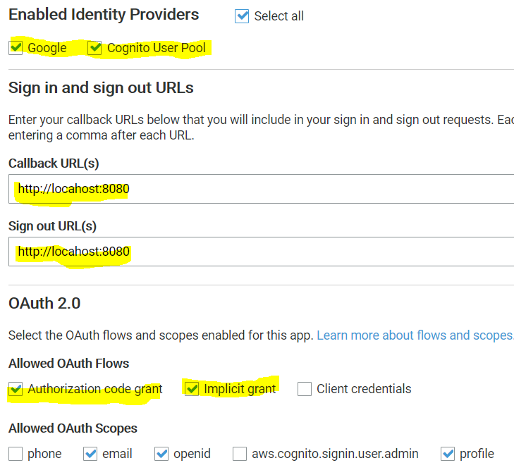
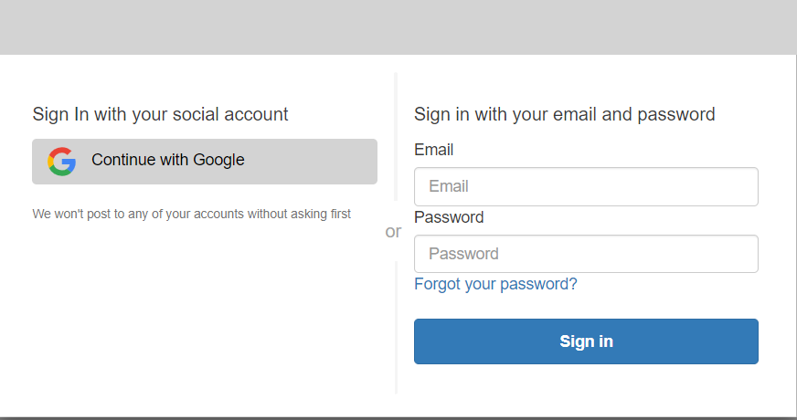

## AWS CLIでCognitoユーザーのパスワード変更
```$xslt
aws cognito-idp admin-initiate-auth \
--user-pool-id us-west-2_xxxx \
--client-id xxxx \
--auth-flow ADMIN_NO_SRP_AUTH \
--auth-parameters \
USERNAME=xxxx,PASSWORD=xxxx
  -> sessionが取得できる 

aws cognito-idp admin-respond-to-auth-challenge \
--user-pool-id us-west-2_xxxx \
--client-id xxxx \
--challenge-name NEW_PASSWORD_REQUIRED \
--challenge-responses NEW_PASSWORD='xxxx',USERNAME=xxxx \
--session "xxx"
```

## IdTokenをDecodeしてみる
* ツール
    * https://jwt.io/
* 中身
```
    {
      "sub": "3ad0a201-912d-4ab2-8a93-597a896d3eea",
      "aud": "{App Client Id}",
      "email_verified": true,
      "event_id": "81775974-6b0d-11e9-803b-1946dd43098e",
      "token_use": "id",
      "auth_time": 1556604136,
      "iss": "https://cognito-idp.us-west-2.amazonaws.com/{UserPool Id}",
      "cognito:username": "{UserId}",
      "exp": 1556607736,
      "iat": 1556604136,
      "email": "{Email}"
    }
```

## Cognito Custom Authorizer
### Cognito

### Lambda

## Googleアカウントの認証を使って、JWTを取得
* ログイン用のURL（Domain）の設定
    * https://ys-dev-web.auth.us-west-2.amazoncognito.com
* Googleの開発アカウントの設定
    * アプリケーションの種類
        * ウェブアプリケーション
    * 認証済みのリダイレクトURI
        * https://ys-dev-web.auth.us-west-2.amazoncognito.com/oauth2/idpresponse
* CognitoでGoogle連携の設定
    * Googleの開発アカウントで取得した、ClientId、ClientSecretを設定する
    * 
* コールバック用のWebアプリ設定
    * ローカルのダミーWebアプリでOK
    * http://locahost
* ログイン用URLにアクセスし、Googleアカウントで認証
    * https://ys-dev-web.auth.us-west-2.amazoncognito.com/login?response_type=code&client_id={clientId}&redirect_uri=http://localhost
    * 
* 上記のコールバックURLについてくる認証コードの取得
    * http://localhost/?code=XXXX
* 上記の認証コードを使って、JWTの取得
    ```
    curl -X POST -H 'Content-Type:application/x-www-form-urlencoded' --verbose 'https://ys-dev-web.auth.us-west-2.amazoncognito.com/oauth2/token?grant_type=authorization_code&client_id=xxxx&redirect_uri=http://localhost&code=xxxx'
    ```
* IdToken(JWT)をAuthorizationヘッダに付与して、ApiGatewayにアクセスする
    * 有効期限内の1時間はこれでOK、切れた場合は更新が必要
* Refresh Tokenを使って、IdTokenを更新
    ```
    curl -X POST -H 'Content-Type:application/x-www-form-urlencoded' --verbose 'https://ys-dev-web.auth.us-west-2.amazoncognito.com/oauth2/token?grant_type=refresh_token&client_id=xxxx&refresh_token=xxxx
    ```

## 参考URL
* [Cognito UserPoolsのFederationの使い方と、そのJWTを独自APIサーバーで検証する方法](https://qiita.com/yoskeoka/items/7474845087c66cf91b27)
* [AWS CognitoとAPI Gatewayを組み合わせて、スマホアプリで要ログインなAPIを作る](https://qiita.com/lazyfellow/items/e6dd2941de9ae3d02d00)
* [Cognitoから払い出されたIdTokenをAPI Gateway カスタムオーソライザーのLambda(Python3.6)で検証する方法](https://dev.classmethod.jp/cloud/aws/verify_cognit_idtoken_by_apig_custom_auth/)